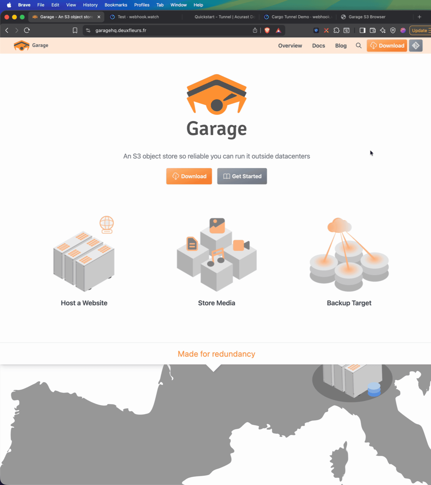
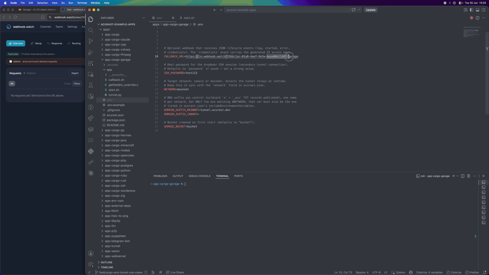
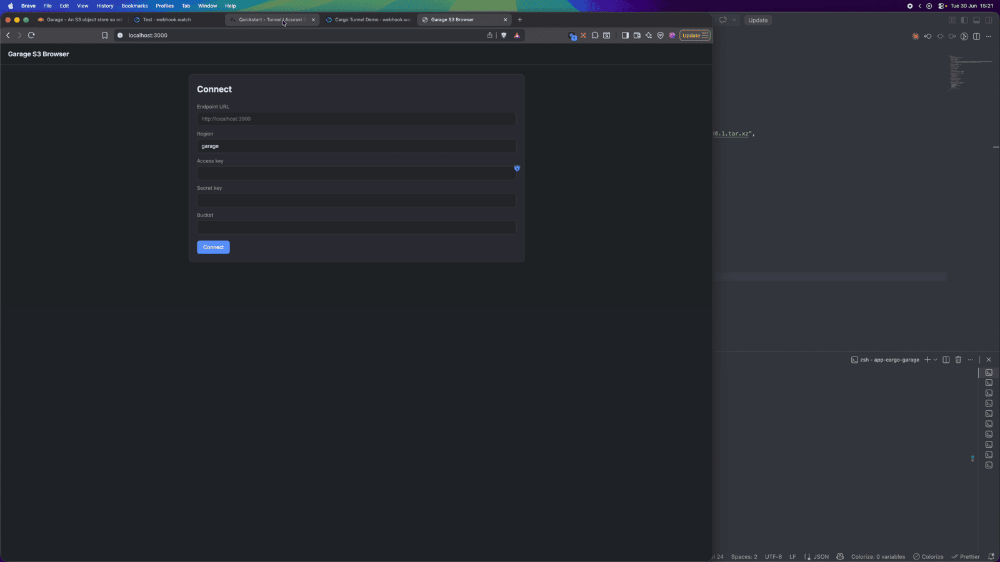
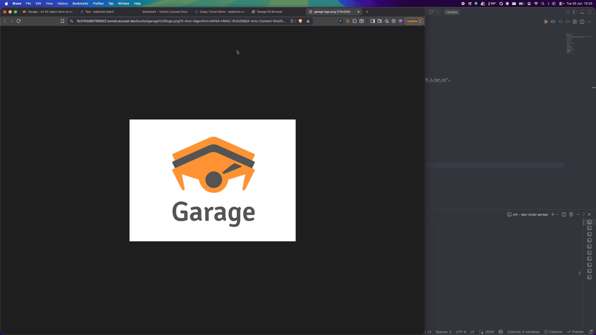
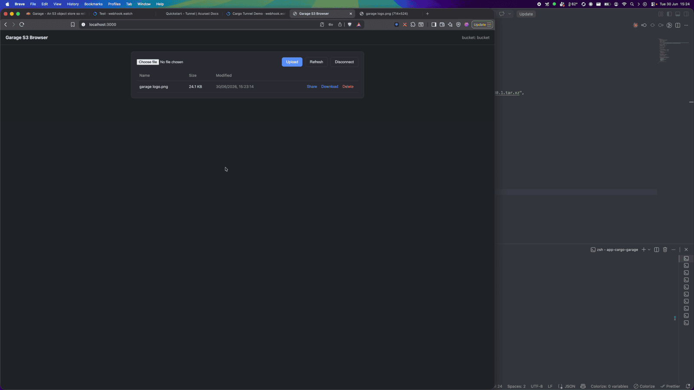

# Run S3-Compatible Storage on Acurast

This example runs a single-node [Garage](https://garagehq.deuxfleurs.fr)
**S3-compatible object store** inside an Acurast Cargo deployment and exposes it
over the Acurast Tunnel's two connections:

- **primary** connection → the **S3 API** (port `3900`), usable by any S3 client at
  `https://<clientId>.<DOMAIN_SUFFIX>` (path-style, region `garage`), and
- **secondary** connection → **SSH** for shell access.

The generated S3 access keys are delivered to you as a `credentials` webhook event.

## 1. Get the repo and open the example

```bash
git clone https://github.com/Acurast/acurast-example-apps.git
cd acurast-example-apps/apps/app-cargo-garage
```



## 2. What's in the `app/` folder

| File | Purpose |
| --- | --- |
| `start.sh` | Entrypoint. **Phase 1:** installs SSH + tunnel deps, builds the `getifaddrs` shim, starts Dropbear and the tunnel. **Phase 2:** downloads the Garage binary, writes a single-node config, starts the server, creates the bucket + access key, and starts the S3 API. SSH comes up first so a stalled Phase 2 is still debuggable. |
| `tunnel.py` | Opens the reverse tunnel — primary → S3 API (`3900`), secondary → SSH (`2222`). |
| `getifaddrs_override.c` | PRoot shim. |
| `callback.sh` | POSTs `log` / `started` / `error` / `credentials` events to your `CALLBACK_URL`. |

## 3. Prerequisite: a domain suffix you control

The tunnel needs a DNS suffix with a wildcard record and an `_acu` TXT record — a
one-time setup covered by the
[Tunnel Quick Start](/developers/getting-started/quickstart-tunnel)
(step 2). Here it's `tunnel.acurast.dev`.

## 4. Configure `.env`

```bash
cp .env.example .env
```

| Variable | Required | What to set |
| --- | --- | --- |
| `ACURAST_MNEMONIC` | ✅ | Deployer seed phrase. **Never commit it.** |
| `NETWORK` | ✅ | `canary` or `mainnet`. Must match `acurast.json`. |
| `DOMAIN_SUFFIX_MAINNET` / `_CANARY` | ✅ (active one) | Your tunnel DNS suffix. Set only the one matching `NETWORK`. |
| `SSH_PASSWORD` | optional | Root SSH password. Defaults to `password` — set a strong value. |
| `GARAGE_BUCKET` | optional | Bucket created on first start (defaults to `bucket`). |
| `CALLBACK_URL` | optional | Lifecycle-event webhook — **carries the generated S3 keys.** Use [webhook.watch](https://webhook.watch). |

### Getting a `CALLBACK_URL` from webhook.watch

Open [webhook.watch](https://webhook.watch) for a unique inspector URL and paste it
into `CALLBACK_URL`. This matters more here than usual: the deployment POSTs a
`credentials` event containing the **access key and secret** for your bucket — you
read them straight out of the webhook.watch dashboard.



## 5. A glance at `acurast.json`

- `runtime: "Shell"` on a `proot-distro` Ubuntu image.
- `execution`: `onetime`, `maxExecutionTimeInMs: 14400000` (a 4-hour window).
- `minProcessorVersions.android: "1.26.0"` (tunnel support).
- `includeEnvironmentVariables`: `CALLBACK_URL`, `SSH_PASSWORD`,
  `DOMAIN_SUFFIX_MAINNET`, `NETWORK`, `GARAGE_BUCKET`.

## 6. Deploy

```bash
npm i
npm run deploy   # runs `acurast deploy`
```

The CLI shows the reward market and a **suggested price** — accept it and confirm.


Then watch webhook.watch. After the install `log` events, the **`credentials`**
event arrives with the region (`garage`), the bucket, and your `accessKeyId` /
`secretAccessKey`.


---

## Part 2 — Using the object store

You now have an S3 endpoint and keys. Any S3 client works — here's the AWS CLI
(note path-style and region `garage`):

```bash
export AWS_ACCESS_KEY_ID=GK...        # from the credentials event
export AWS_SECRET_ACCESS_KEY=...

aws --endpoint-url https://<clientId>.<DOMAIN_SUFFIX> --region garage \
  s3 cp ./file.txt s3://bucket/
aws --endpoint-url https://<clientId>.<DOMAIN_SUFFIX> --region garage \
  s3 ls s3://bucket/
```

### Browse it with a web UI

Because the primary connection has a real Let's Encrypt certificate, any
browser-based S3 explorer can talk to it directly. Point it at the tunnel endpoint,
set region `garage`, enable **path-style**, and paste the keys from the
`credentials` event.



From there it's an ordinary object store — upload a file and preview it right in
the browser (served back through the tunnel via a presigned URL)…



…and it shows up in the bucket, downloadable and shareable.



A working S3 endpoint, served from a phone. Keep in mind: stored objects live in
the processor's ephemeral storage and are **lost when the deployment ends** — this
is disposable/demo storage, and the generated keys should be treated as secret.
