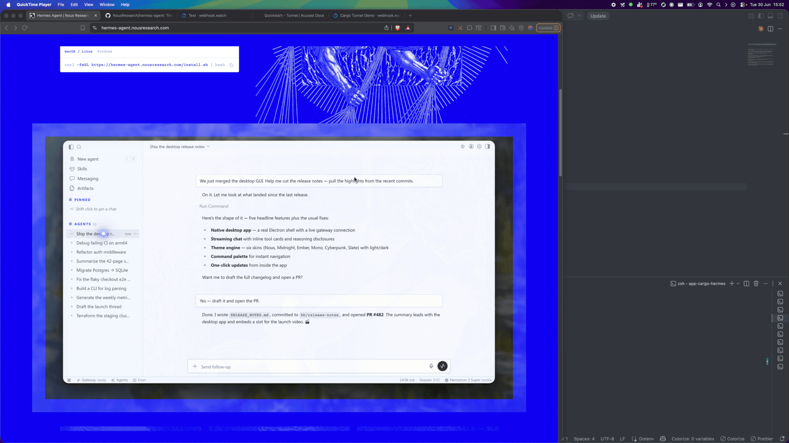
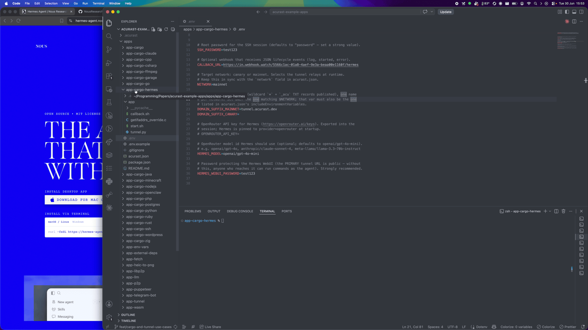
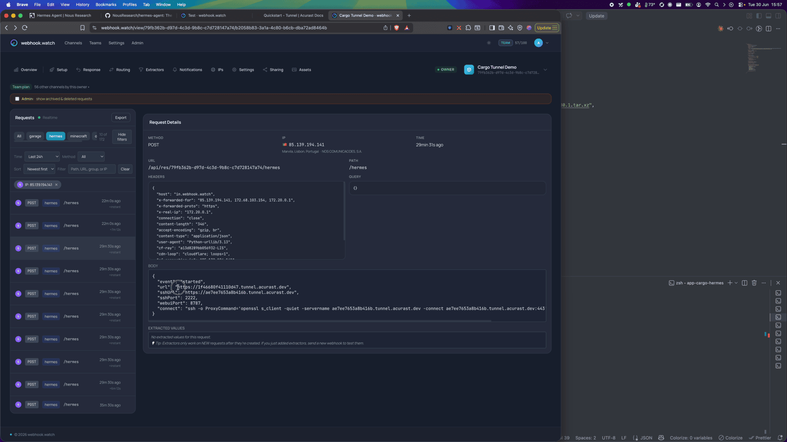
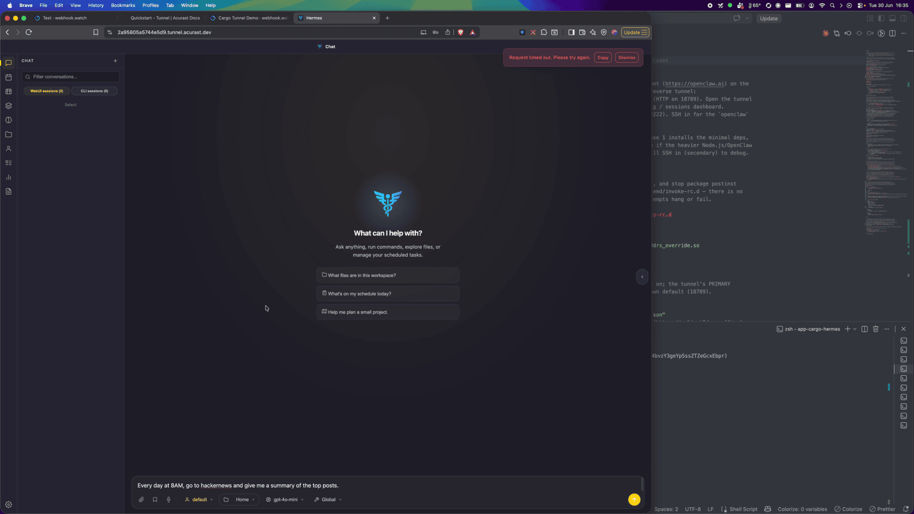
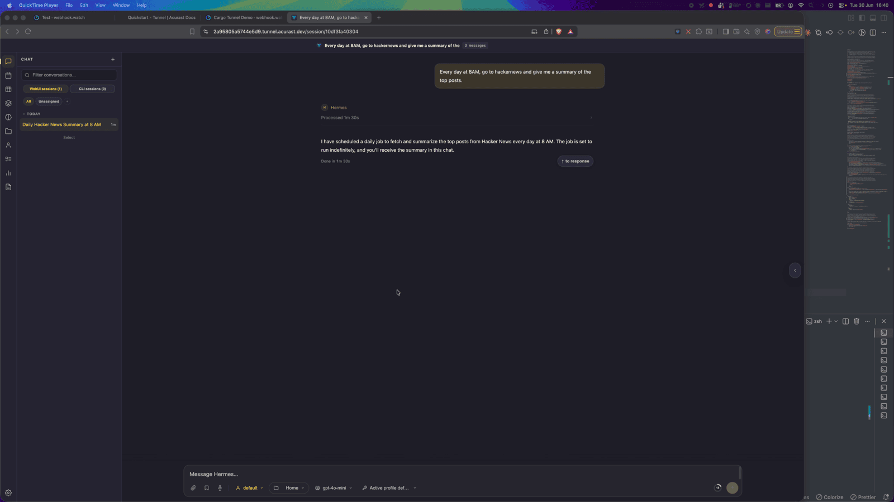
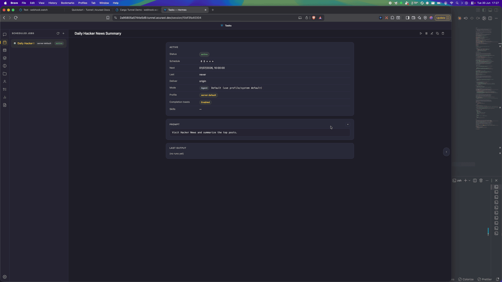

# Run the Hermes AI Agent on Acurast

This example runs [Hermes](https://hermes-agent.org) — an open-source autonomous AI
agent by Nous Research — on an Acurast processor, exposed over the Acurast Tunnel
two ways at once:

- **primary** connection → the **Hermes WebUI** (HTTP on `8787`). Open the tunnel
  URL in a browser for the full chat / sessions / scheduled-jobs UI.
- **secondary** connection → **SSH** (Dropbear on `2222`) for the `hermes` CLI or
  debugging.

## 1. Get the repo and open the example

```bash
git clone https://github.com/Acurast/acurast-example-apps.git
cd acurast-example-apps/apps/app-cargo-hermes
```



## 2. What's in the `app/` folder

| File | Purpose |
| --- | --- |
| `start.sh` | Entrypoint. **Phase 1:** installs Dropbear + git, builds the `getifaddrs` shim, starts SSH and the tunnel. **Phase 2:** runs the official Hermes installer, pins it to OpenRouter, starts the WebUI on loopback `8787` and the Hermes gateway (the cron scheduler). SSH comes up first so a slow Phase 2 is still debuggable. |
| `tunnel.py` | Opens the reverse tunnel — primary → WebUI (`8787`), secondary → SSH (`2222`). |
| `getifaddrs_override.c` | PRoot shim. |
| `callback.sh` | POSTs `log` / `started` / `error` (and `webui_password`) events to your `CALLBACK_URL`. |

## 3. (Optional) Use your own domain

By default the tunnel serves on `https://<clientId>.acu.run`, with a Let's Encrypt
certificate provisioned automatically — nothing to set up. To use your own domain
suffix instead, do the one-time DNS setup (a wildcard record and an `_acu` TXT
record) from the
[Tunnel Quick Start](/developers/getting-started/quickstart-tunnel)
(step 2) and set `DOMAIN_SUFFIX_MAINNET`/`_CANARY` below.

## 4. Configure `.env`

```bash
cp .env.example .env
```

| Variable | Required | What to set |
| --- | --- | --- |
| `ACURAST_MNEMONIC` | ✅ | Deployer seed phrase. **Never commit it.** |
| `OPENROUTER_API_KEY` | ✅ | Your [OpenRouter](https://openrouter.ai/keys) API key — Hermes is pinned to `provider=openrouter`. |
| `NETWORK` | ✅ | `canary` or `mainnet`. Must match `acurast.json`. |
| `DOMAIN_SUFFIX_MAINNET` / `_CANARY` | optional | Only for a custom domain. Leave unset to serve on `acu.run`. If set, use the one matching `NETWORK` and add it to `includeEnvironmentVariables`. |
| `HERMES_MODEL` | optional | OpenRouter model id (default `openai/gpt-4o-mini`). |
| `HERMES_WEBUI_PASSWORD` | optional | Protects the public WebUI. If unset, `start.sh` generates a strong one and reports it as the `webui_password` event — the URL is never left open. |
| `SSH_PASSWORD` | optional | Root SSH password. Defaults to `password` — set a strong value. |
| `CALLBACK_URL` | optional | Lifecycle-event webhook. Use [webhook.watch](https://webhook.watch). |

### Getting a `CALLBACK_URL` from webhook.watch

Open [webhook.watch](https://webhook.watch), grab the unique inspector URL, and
paste it into `CALLBACK_URL`. The `started` event delivers the WebUI URL and SSH
command — and, if you didn't set one, the auto-generated `HERMES_WEBUI_PASSWORD`
arrives as a `webui_password` event.



## 5. A glance at `acurast.json`

- `runtime: "Shell"` on a `proot-distro` Ubuntu image.
- `execution`: `onetime`, `maxExecutionTimeInMs: 14400000` (a 4-hour window — the
  installer downloads a fair amount, so give it time).
- `minProcessorVersions.android: "1.26.0"` (tunnel support).
- `includeEnvironmentVariables`: `CALLBACK_URL`, `NETWORK`, `SSH_PASSWORD`,
  `OPENROUTER_API_KEY`, `HERMES_MODEL`, `HERMES_WEBUI_PASSWORD`.

## 6. Deploy

```bash
npm i
npm run deploy   # runs `acurast deploy`
```

The CLI shows the reward market and a **suggested price** — accept it and confirm.


Then watch webhook.watch. After the (fairly long) install, the `started` event
arrives with the WebUI URL and the SSH connect command.



---

## Part 2 — Talking to the agent

### Open the WebUI

Open the `url` from the `started` event and authenticate with your
`HERMES_WEBUI_PASSWORD` (or the auto-generated one from the `webui_password`
event). You land in the Hermes chat.



### Give it a recurring task

Hermes isn't just a chat box — the gateway runs a cron scheduler, so you can ask it
to do things on a schedule. In the demo it's asked to *"every day at 8AM, go to
Hacker News and summarize the top posts"*, and it confirms it created a recurring
job — which now shows up in the sidebar.



You can open the job to see its cron schedule, prompt, and run history — an
autonomous agent ticking away on a phone.



### SSH for the CLI

Need the `hermes` CLI? Run the `connect` command from the `started` event and
authenticate with `SSH_PASSWORD`:

```bash
ssh -o ProxyCommand='openssl s_client -quiet \
  -servername <secondaryClientId>.acu.run \
  -connect <secondaryClientId>.acu.run:443' \
  root@<secondaryClientId>
```

The session is ephemeral — memory and skills are **lost when the deployment
ends**.
