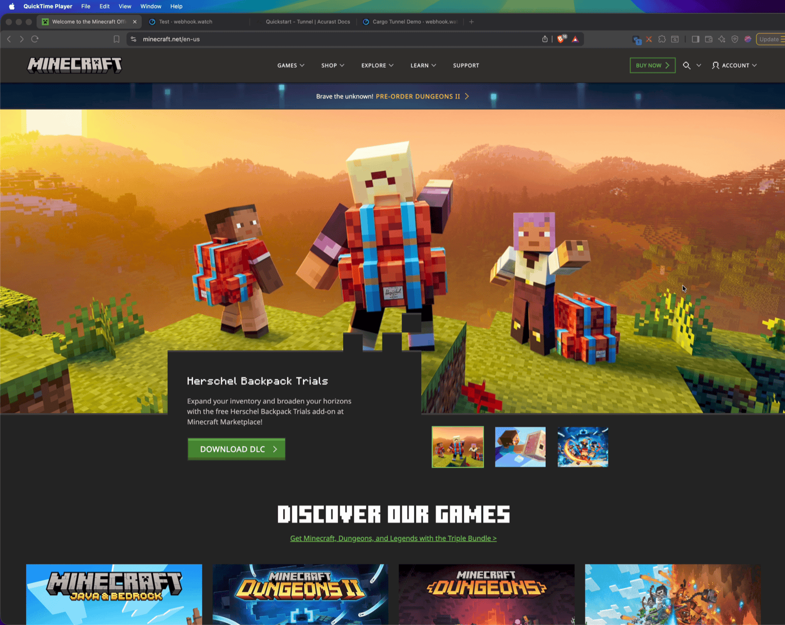
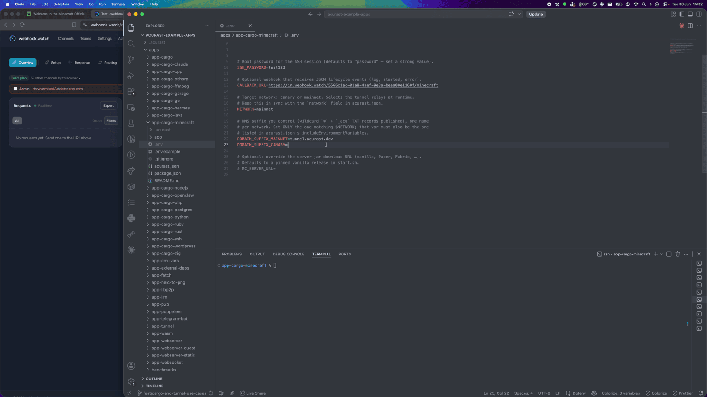
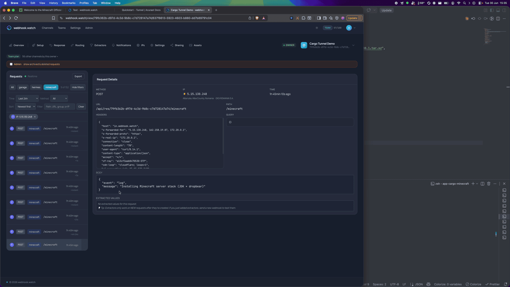
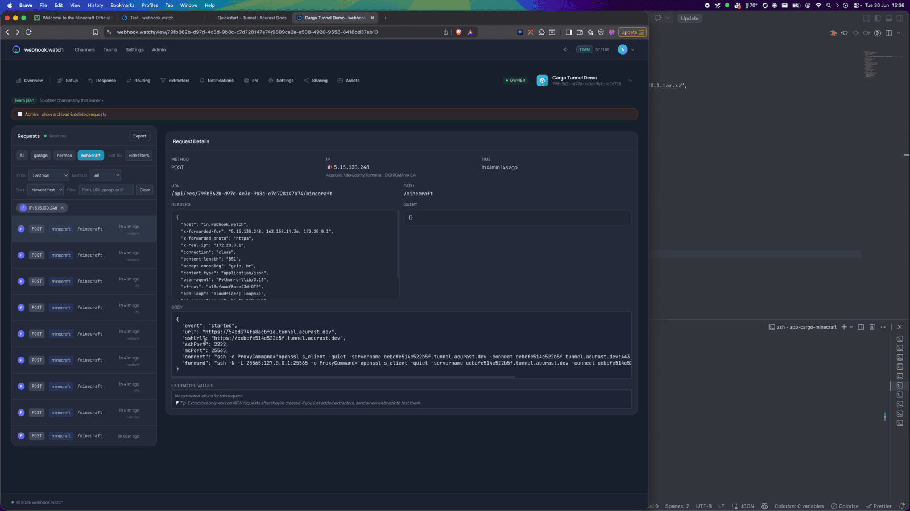
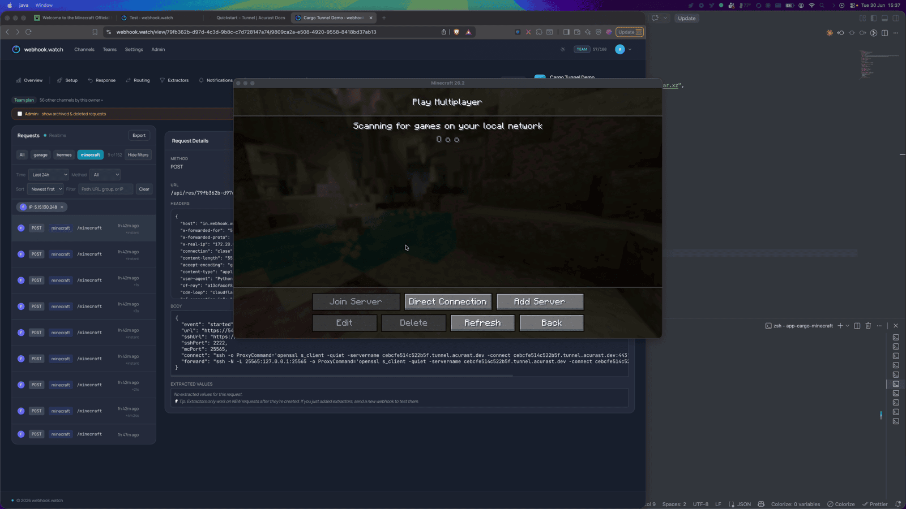
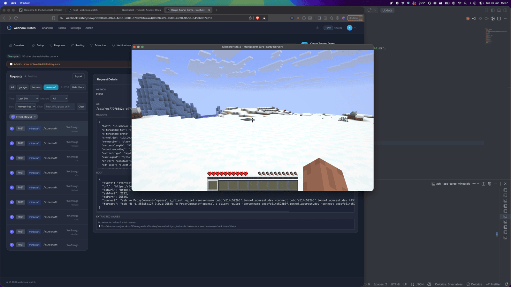
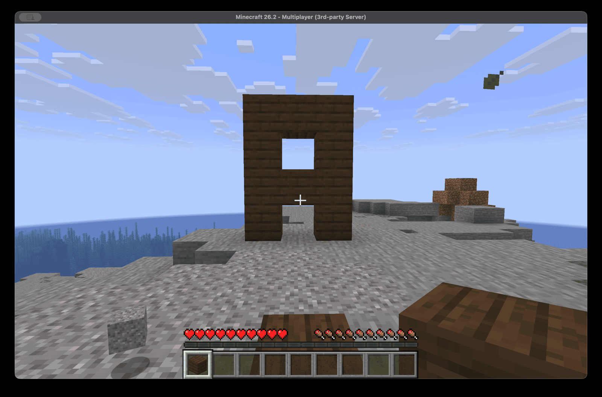

# Run a Minecraft Server on Acurast

This example runs a **Minecraft Java server** inside an Acurast Cargo deployment
and exposes it over the Acurast Tunnel's two connections:

- **primary** connection → the Minecraft server port (`25565`), and
- **secondary** connection → **SSH** (Dropbear on `2222`).

Minecraft's wire protocol is raw TCP, not TLS — so the easy way to play is to SSH
in over the secondary connection and **local-forward** the game port (`ssh -L`).
The SSH session carries the raw TCP, no TLS wrapper needed on your machine.

:::note
Deploying this app **accepts the [Minecraft EULA](https://aka.ms/MinecraftEULA)** (`start.sh` writes `eula=true`).
:::

## 1. Get the repo and open the example

```bash
git clone https://github.com/Acurast/acurast-example-apps.git
cd acurast-example-apps/apps/app-cargo-minecraft
```



## 2. What's in the `app/` folder

| File | Purpose |
| --- | --- |
| `start.sh` | Entrypoint. Installs a JDK + Dropbear, builds the `getifaddrs` shim, downloads the server jar, writes `eula=true` and a loopback-bound `server.properties`, starts the server on `127.0.0.1:25565` and SSH on `127.0.0.1:2222`. |
| `tunnel.py` | Opens the reverse tunnel — primary → Minecraft (`25565`), secondary → SSH (`2222`). |
| `getifaddrs_override.c` | PRoot shim. |
| `callback.sh` | POSTs `log` / `started` / `error` events to your `CALLBACK_URL`. |

## 3. (Optional) Use your own domain

By default the tunnel serves on `https://<clientId>.acu.run`, with a Let's Encrypt
certificate provisioned automatically — nothing to set up. To use your own domain
suffix instead, do the one-time DNS setup (a wildcard record and an `_acu` TXT
record) from the
[Tunnel Quick Start](/developers/getting-started/quickstart-tunnel)
(step 2) and set `DOMAIN_SUFFIX_MAINNET`/`_CANARY` below.

## 4. Configure `.env`

```bash
cp .env.example .env
```

| Variable | Required | What to set |
| --- | --- | --- |
| `ACURAST_MNEMONIC` | ✅ | Deployer seed phrase. **Never commit it.** |
| `NETWORK` | ✅ | `canary` or `mainnet`. Must match `acurast.json`. |
| `DOMAIN_SUFFIX_MAINNET` / `_CANARY` | optional | Only for a custom domain. Leave unset to serve on `acu.run`. If set, use the one matching `NETWORK` and add it to `includeEnvironmentVariables`. |
| `SSH_PASSWORD` | optional | Root SSH password. Defaults to `password` — set a strong value. |
| `MC_SERVER_URL` | optional | Override the server jar URL (vanilla/Paper/Fabric). Defaults to a pinned vanilla release. |
| `CALLBACK_URL` | optional | Lifecycle-event webhook. Use [webhook.watch](https://webhook.watch). |

### Getting a `CALLBACK_URL` from webhook.watch

Open [webhook.watch](https://webhook.watch), grab the unique inspector URL, and
paste it into `CALLBACK_URL`. The `started` event that lands there carries the SSH
`connect` command and the `forward` command you'll use to play.



## 5. A glance at `acurast.json`

- `runtime: "Shell"` on a `proot-distro` Ubuntu image.
- `execution`: `onetime`, `maxExecutionTimeInMs: 14400000` (a 4-hour window).
- `minProcessorVersions.android: "1.26.0"` (tunnel support).
- `includeEnvironmentVariables`: `CALLBACK_URL`, `NETWORK`, `SSH_PASSWORD`.

## 6. Deploy

```bash
npm i
npm run deploy   # runs `acurast deploy`
```

The CLI shows the reward market and a **suggested price** — accept it and confirm.


Then watch webhook.watch. The install downloads a JDK and the server jar, so you'll
see a run of `log` events first…



…and finally the `started` event with the SSH `connect` and `forward` commands.

---

## Part 2 — Playing on the server

### Forward the game port over SSH

Run the `forward` command from the `started` event — it local-forwards `25565`
over the (TLS-wrapped) secondary SSH connection:

```bash
ssh -N -L 25565:127.0.0.1:25565 \
  -o ProxyCommand='openssl s_client -quiet \
    -servername <secondaryClientId>.acu.run \
    -connect <secondaryClientId>.acu.run:443' \
  root@<secondaryClientId>
```

Leave it running.



### Add the server and join

In your Minecraft client, add a multiplayer server with the address
`127.0.0.1:25565` (that's your local end of the forward).



Join — and you're playing on a world hosted on a phone.





Your Minecraft client version must match the server jar version. The world lives
in ephemeral storage and is **lost when the deployment ends** — great for a
throwaway session with friends, not for a persistent survival world (yet).
