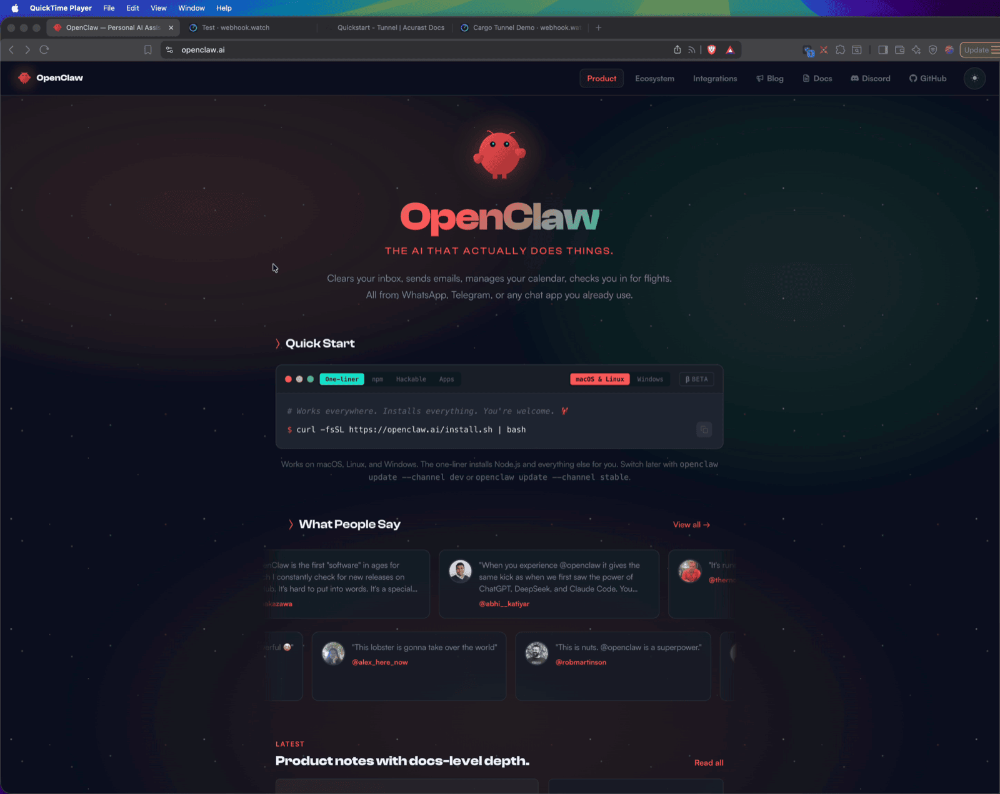
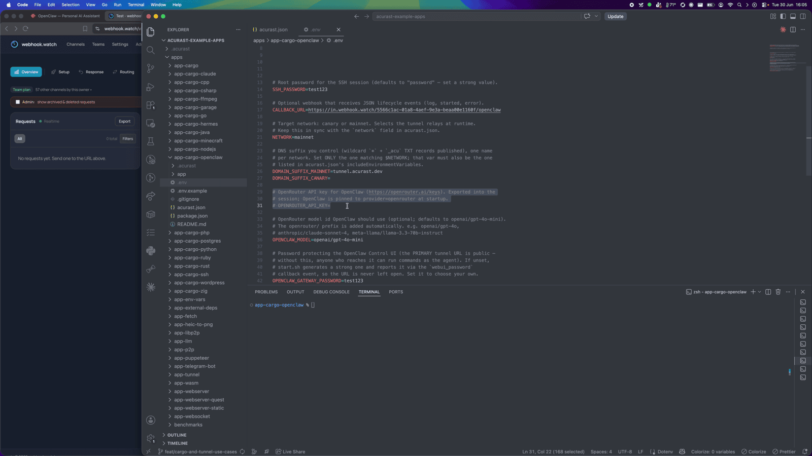
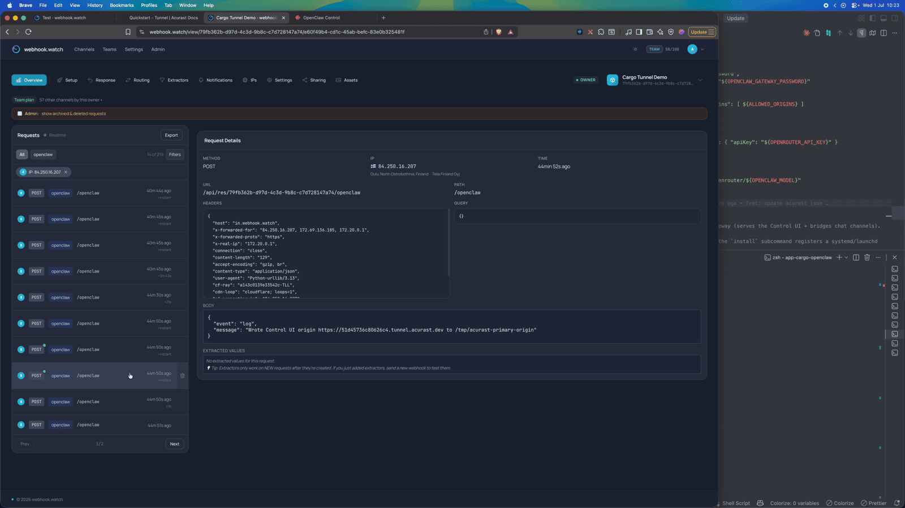
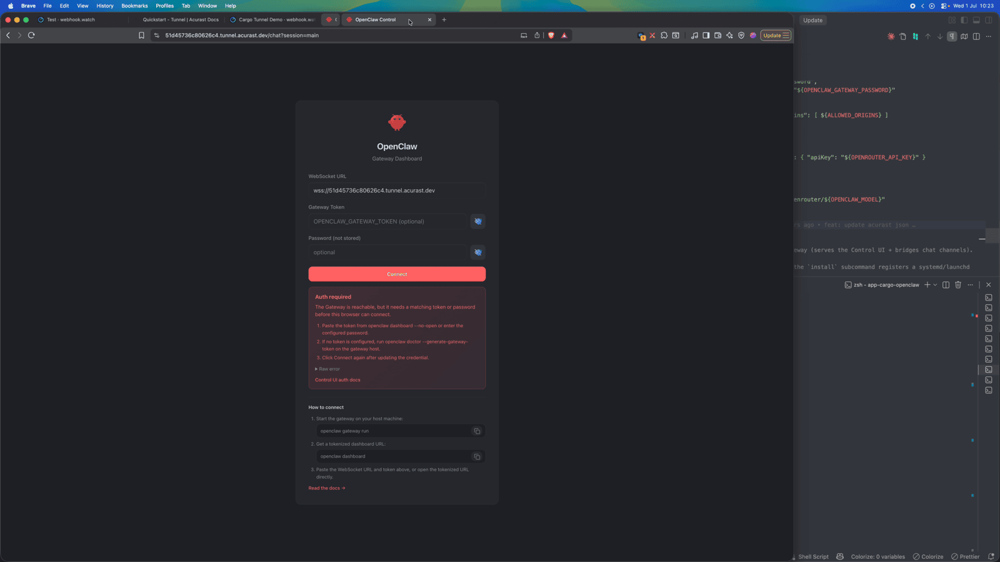
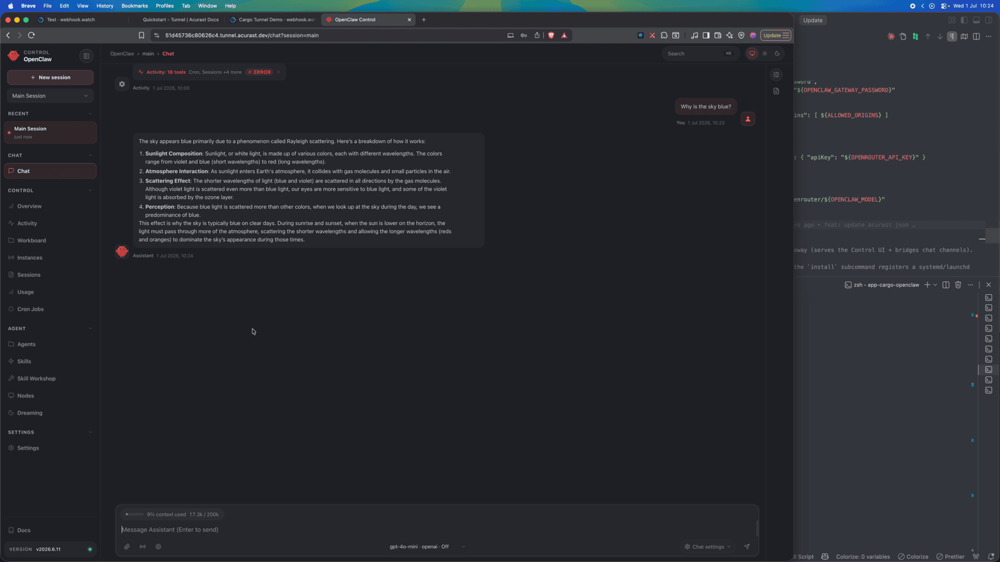

# Run the OpenClaw AI Assistant on Acurast

This example runs [OpenClaw](https://openclaw.ai) — an open-source personal AI
assistant, "the AI that actually does things" — on an Acurast processor, exposed
over the Acurast Tunnel two ways at once:

- **primary** connection → the **OpenClaw Control UI** (HTTP on `18789`). Open the
  tunnel URL in a browser for the full chat / sessions / config dashboard.
- **secondary** connection → **SSH** (Dropbear on `2222`) for the `openclaw` CLI
  (e.g. `openclaw onboard` to link chat channels) or debugging.

## 1. Get the repo and open the example

```bash
git clone https://github.com/Acurast/acurast-example-apps.git
cd acurast-example-apps/apps/app-cargo-openclaw
```



## 2. What's in the `app/` folder

| File | Purpose |
| --- | --- |
| `start.sh` | Entrypoint. **Phase 1:** installs Dropbear, builds the `getifaddrs` shim, starts SSH and the tunnel. **Phase 2:** installs Node.js + the `openclaw` npm package, writes a headless config (gateway on loopback `18789`, **password auth forced**, model pinned to OpenRouter), and starts the gateway that serves the Control UI. SSH comes up first so a slow Phase 2 is still debuggable. |
| `tunnel.py` | Opens the reverse tunnel — primary → Control UI (`18789`), secondary → SSH (`2222`). |
| `getifaddrs_override.c` | PRoot shim. |
| `callback.sh` | POSTs `log` / `started` / `error` (and `webui_password`) events to your `CALLBACK_URL`. |

## 3. Prerequisite: a domain suffix you control

The tunnel needs a DNS suffix with a wildcard record and an `_acu` TXT record — a
one-time setup covered by the
[Tunnel Quick Start](/developers/getting-started/quickstart-tunnel)
(step 2). Here it's `tunnel.acurast.dev`.

## 4. Configure `.env`

```bash
cp .env.example .env
```

| Variable | Required | What to set |
| --- | --- | --- |
| `ACURAST_MNEMONIC` | ✅ | Deployer seed phrase. **Never commit it.** |
| `OPENROUTER_API_KEY` | ✅ | Your [OpenRouter](https://openrouter.ai/keys) API key — OpenClaw is pinned to `provider=openrouter`. |
| `NETWORK` | ✅ | `canary` or `mainnet`. Must match `acurast.json`. |
| `DOMAIN_SUFFIX_MAINNET` / `_CANARY` | ✅ (active one) | Your tunnel DNS suffix. Set only the one matching `NETWORK`. |
| `OPENCLAW_MODEL` | optional | OpenRouter model id (default `openai/gpt-4o-mini`; the `openrouter/` prefix is added for you). |
| `OPENCLAW_GATEWAY_PASSWORD` | optional | Protects the public Control UI. If unset, `start.sh` generates a strong one and reports it as the `webui_password` event — the URL is never left open. |
| `SSH_PASSWORD` | optional | Root SSH password. Defaults to `password` — set a strong value. |
| `CALLBACK_URL` | optional | Lifecycle-event webhook. Use [webhook.watch](https://webhook.watch). |

### Getting a `CALLBACK_URL` from webhook.watch

Open [webhook.watch](https://webhook.watch), grab the unique inspector URL, and
paste it into `CALLBACK_URL`. The `started` event delivers the Control UI URL and
SSH command — and, if you didn't set one, the auto-generated
`OPENCLAW_GATEWAY_PASSWORD` arrives as a `webui_password` event.



## 5. A glance at `acurast.json`

- `runtime: "Shell"` on a `proot-distro` Ubuntu image.
- `execution`: `onetime`, `maxExecutionTimeInMs: 14400000` (a 4-hour window — the
  install downloads a fair amount, so give it time).
- `minProcessorVersions.android: "1.26.0"` (tunnel support).
- `includeEnvironmentVariables`: `CALLBACK_URL`, `DOMAIN_SUFFIX_MAINNET`,
  `NETWORK`, `SSH_PASSWORD`, `OPENROUTER_API_KEY`, `OPENCLAW_MODEL`,
  `OPENCLAW_GATEWAY_PASSWORD`.

## 6. Deploy

```bash
npm i
npm run deploy   # runs `acurast deploy`
```

The CLI shows the reward market and a **suggested price** — accept it and confirm.


Then watch webhook.watch. The two-phase install shows up as `log` events —
"Phase 1: installing SSH + tunnel deps", "Phase 2: installing Node.js" — followed
by the `started` event with the Control UI URL and SSH command.



---

## Part 2 — Using the assistant

### Open the Control UI

Open the `url` from the `started` event. Because the tunnel forwards from loopback,
`start.sh` **forces password auth** so the public URL is never wide open — log in
with your `OPENCLAW_GATEWAY_PASSWORD` (or the auto-generated one from the
`webui_password` event).



Inside you get the full dashboard — chat, sessions, skills, cron jobs — and you can
talk to the assistant right away.



### SSH for the CLI

For first-time channel setup, SSH in and run `openclaw onboard`. OpenClaw connects
through chat apps (WhatsApp, Telegram, Discord, Slack, Signal); link a channel from
the Control UI or via onboarding. Run the `connect` command from the `started`
event and authenticate with `SSH_PASSWORD`:

```bash
ssh -o ProxyCommand='openssl s_client -quiet \
  -servername <secondaryClientId>.<DOMAIN_SUFFIX> \
  -connect <secondaryClientId>.<DOMAIN_SUFFIX>:443' \
  root@<secondaryClientId>
```

The session is ephemeral — config and memory are **lost when the deployment
ends**.
