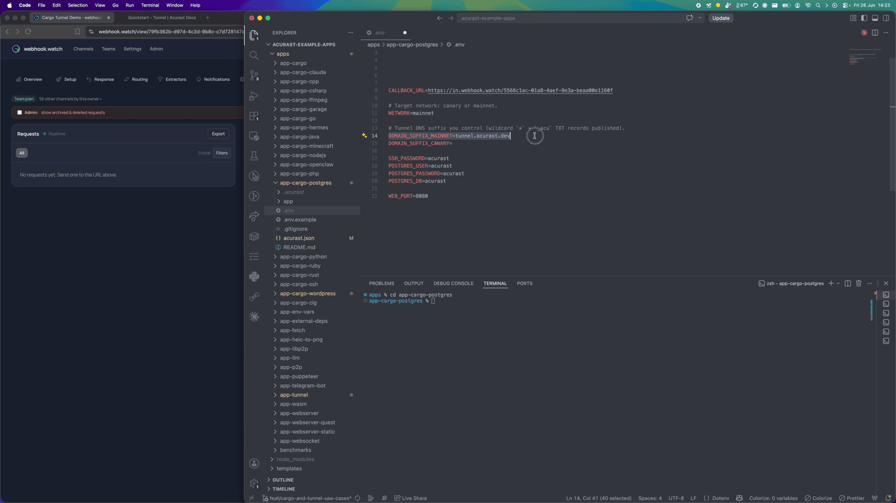
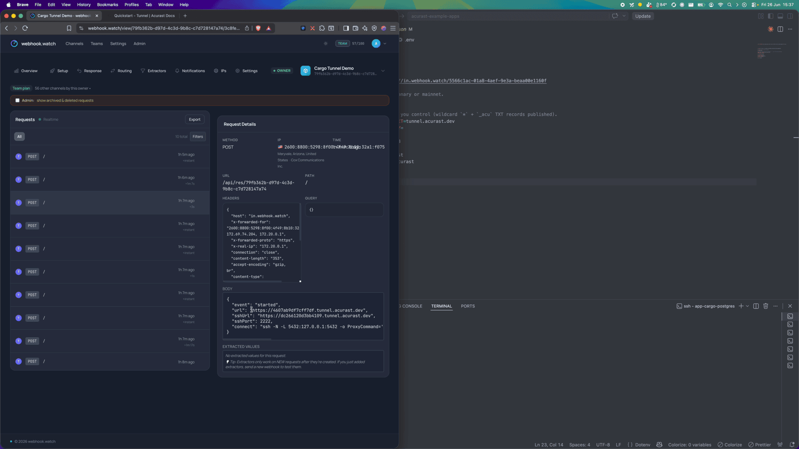
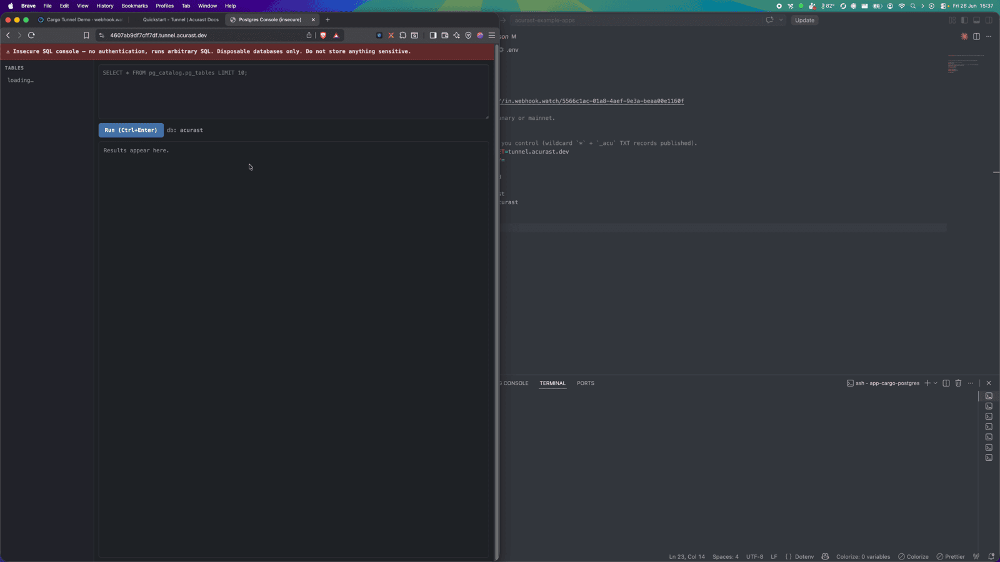
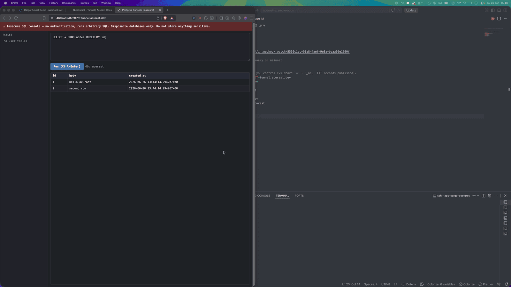

# Run PostgreSQL on Acurast

This example runs a real **PostgreSQL** server inside an Acurast Cargo deployment
and exposes it two ways over the Acurast Tunnel:

- a **browser SQL console** on the primary connection (open it in any browser), and
- **SSH** on the secondary connection, so you can local-forward port `5432` and
  use native `psql`.

Postgres itself only ever listens on loopback — it's never directly reachable;
both paths reach it from inside the deployment.

:::warning
The web console has **no authentication** and runs arbitrary SQL. It's for disposable/test databases only. SSH access is gated by `SSH_PASSWORD`.
:::

## 1. Get the repo and open the example

```bash
git clone https://github.com/Acurast/acurast-example-apps.git
cd acurast-example-apps/apps/app-cargo-postgres
```

## 2. What's in the `app/` folder

| File | Purpose |
| --- | --- |
| `start.sh` | Entrypoint. **Phase 1:** installs SSH + tunnel deps, builds the `getifaddrs` shim, starts Dropbear and the tunnel. **Phase 2:** installs Postgres, initializes the data dir, creates the database, and starts the web console. Runs SSH first so a stalled install is still debuggable. |
| `tunnel.py` | Opens the reverse tunnel — primary → web console (`8080`), secondary → SSH (`2222`). |
| `webadmin.py` | The browser SQL console served over the primary connection. |
| `getifaddrs_override.c` / `sysv_shm_override.c` | PRoot shims (Postgres needs the SysV shared-memory one). |
| `callback.sh` | POSTs `log` / `started` / `error` events to your `CALLBACK_URL`. |

## 3. (Optional) Use your own domain

By default the tunnel serves on `https://<clientId>.acu.run`, with a Let's Encrypt
certificate provisioned automatically — nothing to set up. To use your own domain
suffix instead, do the one-time DNS setup (a wildcard record and an `_acu` TXT
record) from the
[Tunnel Quick Start](/developers/getting-started/quickstart-tunnel)
(step 2) and set `DOMAIN_SUFFIX_MAINNET`/`_CANARY` below.

## 4. Configure `.env`

```bash
cp .env.example .env
```

| Variable | Required | What to set |
| --- | --- | --- |
| `ACURAST_MNEMONIC` | ✅ | Deployer seed phrase. **Never commit it.** |
| `NETWORK` | ✅ | `canary` or `mainnet`. Must match `acurast.json`. |
| `DOMAIN_SUFFIX_MAINNET` / `_CANARY` | optional | Only for a custom domain. Leave unset to serve on `acu.run`. If set, use the one matching `NETWORK` and add it to `includeEnvironmentVariables`. |
| `SSH_PASSWORD` | optional | Root SSH password. Defaults to `password` — set a strong value. |
| `POSTGRES_USER` / `POSTGRES_PASSWORD` / `POSTGRES_DB` | optional | Superuser, password and DB created on first start. Set strong values. |
| `CALLBACK_URL` | optional | Lifecycle-event webhook. **Use [webhook.watch](https://webhook.watch).** |

### Getting a `CALLBACK_URL` from webhook.watch

Open [webhook.watch](https://webhook.watch) to get a unique inspector URL, and
paste it into `CALLBACK_URL`. The deployment POSTs its `log` / `started` events
there — including the web URL and the SSH connect command — so you never have to
dig through logs.



## 5. A glance at `acurast.json`

- `runtime: "Shell"` on a `proot-distro` Ubuntu image.
- `execution`: `onetime`, `maxExecutionTimeInMs: 7200000` (2-hour window).
- `minProcessorVersions.android: "1.26.0"` (tunnel support).
- `includeEnvironmentVariables`: `CALLBACK_URL`, `NETWORK`, `SSH_PASSWORD`,
  `POSTGRES_USER/PASSWORD/DB`, `WEB_PORT`.

## 6. Deploy

```bash
npm i
npm run deploy   # runs `acurast deploy`
```

The CLI shows the reward market and a **suggested price** — accept it and confirm.


Then watch webhook.watch. After the install `log` events you'll get the `started`
event with the web URL, the SSH `connect` command, and the `forward` command for
native `psql`.



---

## Part 2 — Using the database

### Option A: SSH in and run native `psql`

The `started` event includes a `forward` command that local-forwards `5432` over
SSH. Run it, then in another terminal:

```bash
psql -h 127.0.0.1 -p 5432 -U <POSTGRES_USER> -d <POSTGRES_DB>
```

### Option B: the browser SQL console

Open the `url` from the `started` event. You land on the SQL console — note the
red **"Insecure SQL console"** banner, a reminder that anyone with the URL has full
access.



From here it's just SQL. Create a table and insert some rows:

```sql
CREATE TABLE notes (id serial primary key, body text, created_at timestamptz default now());
INSERT INTO notes (body) VALUES ('hello acurast'), ('second row');
```


…and query them back:

```sql
SELECT * FROM notes ORDER BY id;
```



A full relational database, running on a phone, reachable from your browser over a
trusted TLS URL. Remember: the storage is ephemeral — everything is lost when the
deployment ends, so treat it as a disposable/test database.
