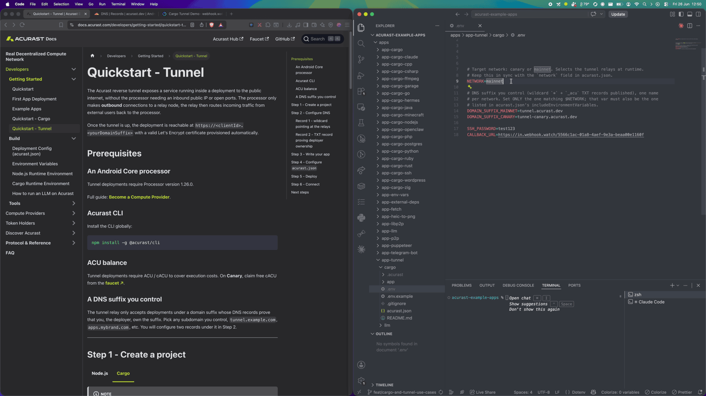
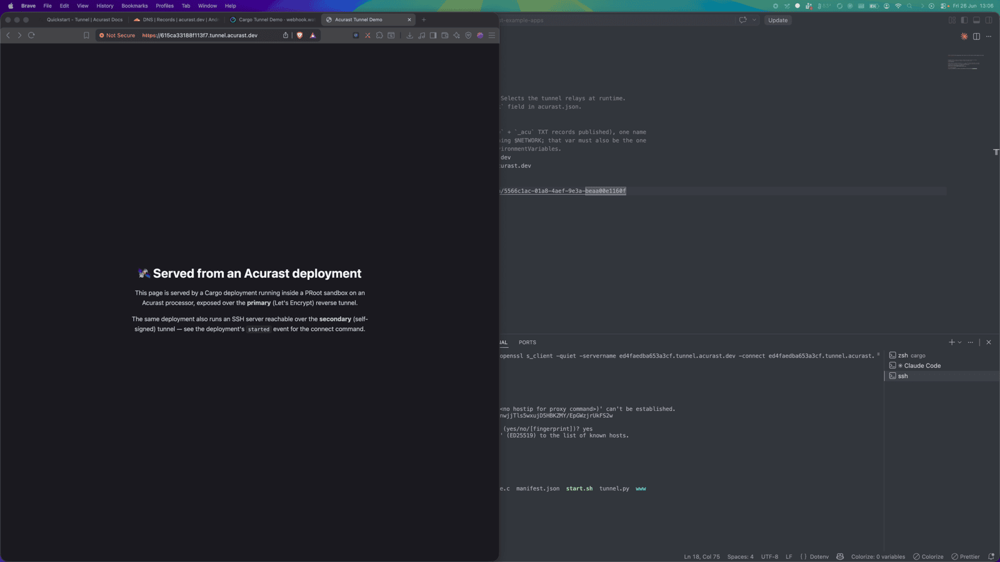

# Expose a Service to the Internet on Acurast

Acurast processors are phones. They sit behind carrier NAT with no public IP — so
how do you reach a service running on one from the open internet? The **Acurast
Tunnel** answers that: the processor opens an outbound reverse tunnel to a relay,
and the relay gives you a public HTTPS URL that forwards straight into your
deployment.

This first example is the simplest possible demonstration: it serves a static web
page **and** a Dropbear SSH server from a single Cargo deployment, each on its own
tunnel connection. Every other Cargo example in this series (Postgres, WordPress,
Garage, Minecraft, Hermes, OpenClaw) is built on exactly this pattern, so it is
the right place to start.

## 1. Get the repo and open the example

```bash
git clone https://github.com/Acurast/acurast-example-apps.git
cd acurast-example-apps/apps/app-tunnel/cargo
```

## 2. What's in the `app/` folder

`app/` is the code that actually gets uploaded to the processor. It's small:

| File | Purpose |
| --- | --- |
| `start.sh` | The deployment **entrypoint**. Installs `dropbear` + Python, builds the `getifaddrs` shim, sets the SSH root password, starts a static web server (`python3 -m http.server`) on `127.0.0.1:8080` and SSH on `127.0.0.1:2222`, then launches `tunnel.py`. |
| `tunnel.py` | Opens the Acurast reverse tunnel — calls `tunnel_start` with `localAddr` (the web page) and `secondaryLocalAddr` (SSH), then reports the public URLs. |
| `getifaddrs_override.c` | A tiny C shim `LD_PRELOAD`ed to work around a PRoot quirk (see [PRoot Quirks](/developers/build/cargo-runtime-environment#proot-quirks)). |
| `callback.sh` | Helper that POSTs JSON lifecycle events (`log`, `started`, `error`) to your `CALLBACK_URL`. |
| `www/index.html` | The static page that gets served. |

The two-connection idea is the key: the **primary** connection gets a real
Let's Encrypt certificate (good for browsers); the **secondary** connection gets a
self-signed cert and is used here to carry raw SSH.

## 3. (Optional) Use your own domain

By default the tunnel serves your deployment on `https://<clientId>.acu.run`, with a
Let's Encrypt certificate provisioned automatically — nothing to set up.

If you'd rather use your own domain suffix, it's a one-time DNS setup (a wildcard
record and an `_acu` TXT record) — follow the
[Tunnel Quick Start](/developers/getting-started/quickstart-tunnel)
(step 2), then set `DOMAIN_SUFFIX_MAINNET`/`DOMAIN_SUFFIX_CANARY` below.

## 4. Configure `.env`

Copy the template and fill it in:

```bash
cp .env.example .env
```

| Variable | Required | What to set |
| --- | --- | --- |
| `ACURAST_MNEMONIC` | ✅ | Your deployer seed phrase (signs the on-chain deployment). **Never commit it.** |
| `NETWORK` | ✅ | `canary` or `mainnet`. Must match the `network` field in `acurast.json`. |
| `DOMAIN_SUFFIX_MAINNET` / `DOMAIN_SUFFIX_CANARY` | optional | Only for a custom domain. Leave unset to serve on `acu.run`. If set, use the one matching `NETWORK` and add it to `includeEnvironmentVariables` in `acurast.json`. |
| `SSH_PASSWORD` | optional | Root password for the SSH session. Defaults to `password` — set a strong value. |
| `CALLBACK_URL` | optional | Webhook that receives the lifecycle events. **Use [webhook.watch](https://webhook.watch).** |

### Getting a `CALLBACK_URL` from webhook.watch

You don't want to chase deployment logs to find your tunnel URL. Instead, open
[webhook.watch](https://webhook.watch), which instantly gives you a unique
inspector URL. Paste that URL into `CALLBACK_URL`. As the deployment runs, its
`log`, `started` and `error` events show up live in the webhook.watch dashboard.



## 5. A glance at `acurast.json`

`acurast.json` is the deployment config. You rarely need to touch it, but it's
worth knowing what it declares:

- `runtime: "Shell"` + `image` — runs your shell app inside a `proot-distro`
  Ubuntu rootfs.
- `execution` — `onetime`, `maxExecutionTimeInMs: 7200000` (a 2-hour window; the
  deployment shuts down after that).
- `minProcessorVersions.android: "1.26.0"` — the tunnel API needs a processor on
  app version 1.26.0 or newer.
- `includeEnvironmentVariables` — the allowlist of `.env` vars forwarded to the
  processor (`CALLBACK_URL`, `SSH_PASSWORD`, `NETWORK`).
- `startAt.msFromNow` — schedules the start a couple of minutes out.

## 6. Deploy

```bash
acurast deploy
```

The CLI shows the current reward market — a distribution of what processors are
charging — and a **suggested price**. Accept the suggested fee and confirm.


The deployment is registered on-chain and scheduled to start (per
`startAt.msFromNow`). Now watch your webhook.watch tab: first `log` events as the
processor installs dependencies, then the **`started`** event carrying your public
web URL and the SSH connect command.


---

## Part 2 — Using the tunnel

This is where each example diverges. For the plain Tunnel example there are two
things to try.

### Open the web page

Take the `url` from the `started` event and open it in a browser:

```
https://<clientId>.acu.run
```

You get a page served *from the phone* over a real HTTPS certificate — no public
IP, no port forwarding, no reverse proxy of your own.



### SSH in over the secondary connection

SSH rides the secondary (self-signed) connection, so it's wrapped in TLS via an
`openssl s_client` ProxyCommand. The `started` event hands you the exact command:

```bash
ssh -o ProxyCommand='openssl s_client -quiet \
  -servername <secondaryClientId>.acu.run \
  -connect <secondaryClientId>.acu.run:8443' \
  root@<secondaryClientId>
```

Authenticate with your `SSH_PASSWORD` and you have a root shell inside the
deployment.

### What just happened

The full path is: your browser → Acurast relay → reverse tunnel → the processor's
sandbox → your service. The processor dialed out; nothing had to be opened
inbound — and yet you get a public, TLS-terminated URL for the web page and a
working SSH login, all from a phone.

That's the whole primitive. Everything else in this series just puts a more
interesting service behind `localAddr`.
