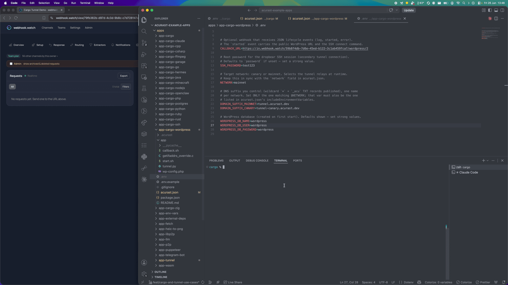
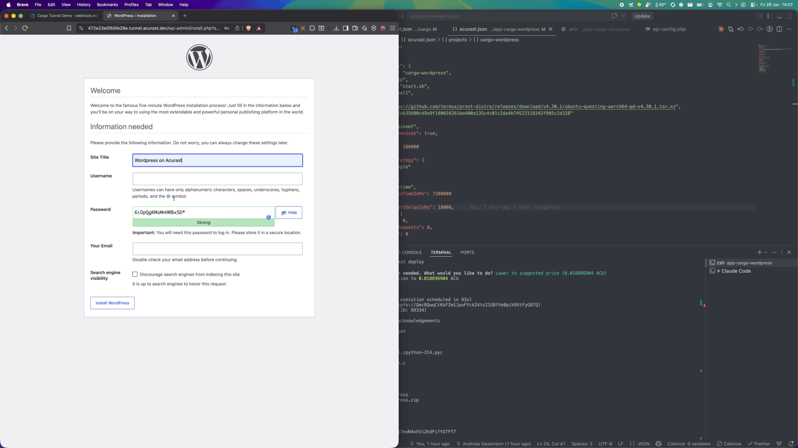
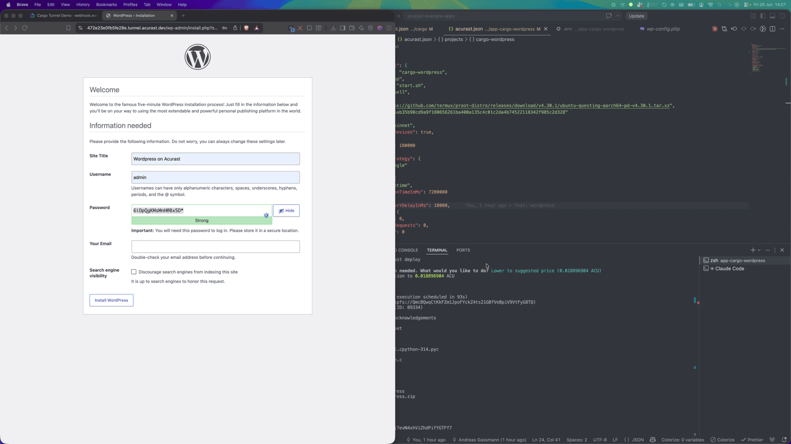
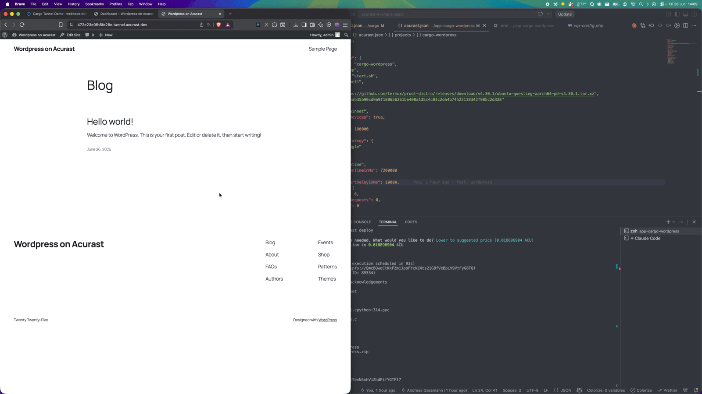
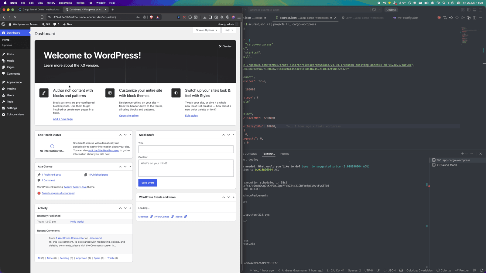

# Host a WordPress Site on Acurast

This example runs a full **WordPress** stack — Apache + PHP + MariaDB — inside an
Acurast Cargo deployment and publishes it over the Acurast Tunnel:

- the **primary** connection serves Apache/WordPress at a real HTTPS URL, and
- the **secondary** connection carries **SSH** for shell access to the deployment.

## 1. Get the repo and open the example

```bash
git clone https://github.com/Acurast/acurast-example-apps.git
cd acurast-example-apps/apps/app-cargo-wordpress
```

## 2. What's in the `app/` folder

| File | Purpose |
| --- | --- |
| `start.sh` | Entrypoint. Installs Apache, PHP, MariaDB and Dropbear; builds the `getifaddrs` shim; initializes MariaDB and creates the DB/user; downloads WordPress core; starts Apache on `127.0.0.1:8080` and SSH on `127.0.0.1:2222`. |
| `wp-config.php` | WordPress config: takes DB creds from the environment and derives `WP_HOME`/`WP_SITEURL` from the request host, so it works at whatever tunnel URL it lands on. Trusts `X-Forwarded-Proto` so WordPress builds `https://` URLs. |
| `tunnel.py` | Opens the reverse tunnel — primary → WordPress (`8080`), secondary → SSH (`2222`). |
| `getifaddrs_override.c` | PRoot shim. |
| `callback.sh` | POSTs `log` / `started` / `error` events to your `CALLBACK_URL`. |

## 3. (Optional) Use your own domain

By default the tunnel serves on `https://<clientId>.acu.run`, with a Let's Encrypt
certificate provisioned automatically — nothing to set up. To use your own domain
suffix instead, do the one-time DNS setup (a wildcard record and an `_acu` TXT
record) from the
[Tunnel Quick Start](/developers/getting-started/quickstart-tunnel)
(step 2) and set `DOMAIN_SUFFIX_MAINNET`/`_CANARY` below.

## 4. Configure `.env`

```bash
cp .env.example .env
```

| Variable | Required | What to set |
| --- | --- | --- |
| `ACURAST_MNEMONIC` | ✅ | Deployer seed phrase. **Never commit it.** |
| `NETWORK` | ✅ | `canary` or `mainnet`. Must match `acurast.json`. |
| `DOMAIN_SUFFIX_MAINNET` / `_CANARY` | optional | Only for a custom domain. Leave unset to serve on `acu.run`. If set, use the one matching `NETWORK` and add it to `includeEnvironmentVariables`. |
| `SSH_PASSWORD` | optional | Root SSH password. Defaults to `password` — set a strong value. |
| `WORDPRESS_DB_NAME` / `_USER` / `_PASSWORD` | optional | Database created on first start. Set strong values. |
| `CALLBACK_URL` | optional | Lifecycle-event webhook. **Use [webhook.watch](https://webhook.watch).** |

### Getting a `CALLBACK_URL` from webhook.watch

Open [webhook.watch](https://webhook.watch), grab the unique inspector URL, and
paste it into `CALLBACK_URL`. The `started` event that arrives there carries the
public WordPress URL and the SSH connect command.



## 5. A glance at `acurast.json`

- `runtime: "Shell"` on a `proot-distro` Ubuntu image.
- `execution`: `onetime`, `maxExecutionTimeInMs: 7200000` (2-hour window).
- `minProcessorVersions.android: "1.26.0"` (tunnel support).
- `includeEnvironmentVariables`: `CALLBACK_URL`, `SSH_PASSWORD`,
  `NETWORK`, `WORDPRESS_DB_NAME/USER/PASSWORD`.

## 6. Deploy

```bash
npm i
npm run deploy   # runs `acurast deploy`
```

The CLI shows the reward market and a **suggested price** — accept it and confirm.


Then watch webhook.watch. The install is heavier than the plain tunnel (Apache,
PHP, MariaDB, WordPress core), so you'll see a run of `log` events first…


…and finally the `started` event with the public URL and SSH command.


---

## Part 2 — Setting up the site

### Run the install wizard

Open the `url` from the `started` event. Because it's a fresh install, WordPress
greets you with its setup wizard — pick a language and fill in the site details.



Set the site title, admin user and password, and finish the install.



### A live site

That's it — you have a real WordPress site running on a phone, reachable at a
trusted HTTPS URL.



Log in at `/wp-admin` and you get the full WordPress dashboard — publish posts,
install themes and plugins, everything.



### Shell access

Need to poke around? Run the `connect` command from the `started` event (it wraps
SSH over the secondary TLS connection) and authenticate with `SSH_PASSWORD`:

```bash
ssh -o ProxyCommand='openssl s_client -quiet \
  -servername <secondaryClientId>.acu.run \
  -connect <secondaryClientId>.acu.run:443' \
  root@<secondaryClientId>
```

Note: the database and uploads live in the processor's ephemeral storage and are
**lost when the deployment ends** — this is a disposable/demo site, not durable
hosting.
