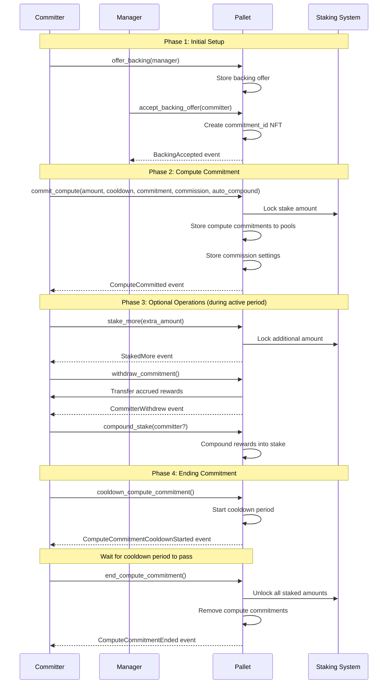
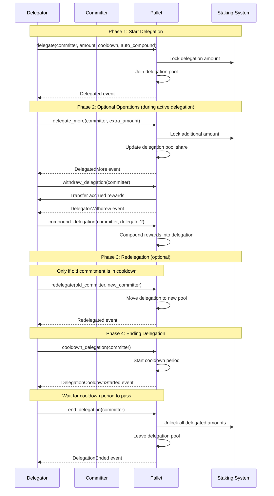
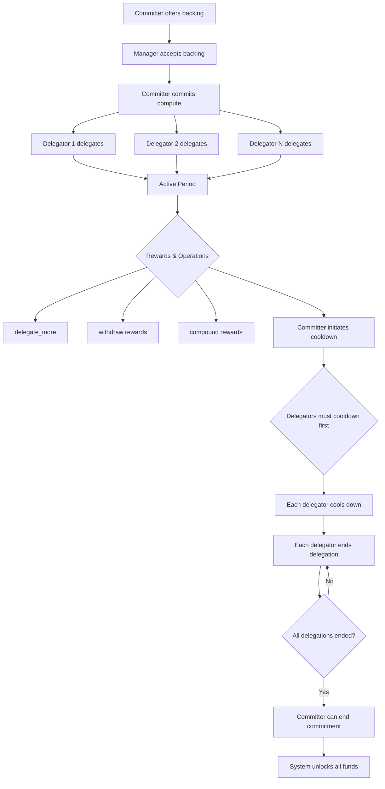
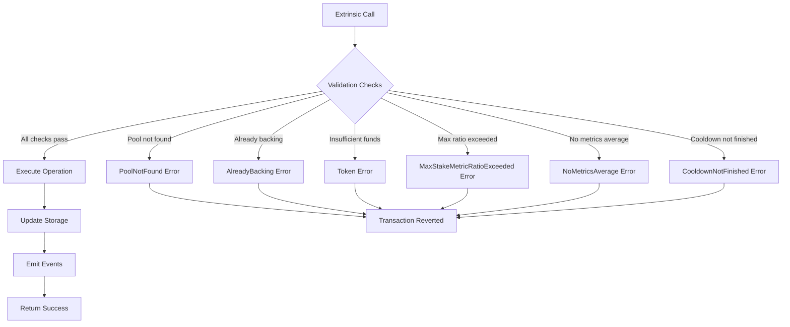

# Public Operations

(Each operation corresponds to a Pallet Compute Extrinsic)

## Backing System

### `offer_backing`

Offers backing to a manager. An account can only have one outstanding offer and only offer if not already owner of a commitment.

**Parameters:**
- `origin`: Signed origin
- `manager`: Account ID of the manager to back

**Events:** `BackingOffered(who, manager_id)`

**Errors:** `AlreadyBacking`

---

### `withdraw_backing_offer`

Withdraws a previously made backing offer.

**Parameters:**
- `origin`: Signed origin

**Events:** `BackingOfferWithdrew(who, manager_id)`

**Errors:** `NoBackingOfferFound`

---

### `accept_backing_offer`

Accepts a backing offer from a potential committer. Only upon acceptance does the offering account receive a new commitment_id.

**Parameters:**
- `origin`: Signed origin (manager)
- `committer`: Account that made the backing offer

**Events:** `BackingAccepted(commitment_id, manager_id)`, potentially `CommitmentCreated(committer, commitment_id)`

**Errors:** `NoBackingOfferFound`

---

## Commitment Management (includes staking)

### `commit_compute`

Commits compute and stakes, defines commission for receiving delegations. Called by the committer that should already be backing a manager.

**Parameters:**
- `origin`: Signed origin (committer)
- `amount`: Stake amount to commit
- `cooldown_period`: Cooldown period in blocks
- `commitment`: Bounded vector of compute commitments to pools
- `commission`: Commission rate for delegations (Perbill)
- `allow_auto_compound`: Whether to allow automatic compounding

**Events:** `ComputeCommitted(commitment_id)`

**Errors:** `NoManagerBackingCommitment`, `NoMetricsAverage`, `MaxMetricCommitmentExceeded`, `ZeroMetricsForValidPools`, `MaxStakeMetricRatioExceeded`

---

### `stake_more`

Increases the stake amount for an existing commitment.

**Parameters:**
- `origin`: Signed origin (committer)
- `extra_amount`: Additional amount to stake

**Events:** `StakedMore(commitment_id, extra_amount)`

**Errors:** `MaxStakeMetricRatioExceeded`

---

### `withdraw_commitment`

Withdraws accrued rewards and slashes for a committer.

**Parameters:**
- `origin`: Signed origin (committer)

**Events:** `CommitterWithdrew(committer, commitment_id, reward_amount)`

**Errors:** `InternalError`

---

### `cooldown_compute_commitment`

Initiates cooldown for a compute commitment.

**Parameters:**
- `origin`: Signed origin (committer)

**Events:** `ComputeCommitmentCooldownStarted(commitment_id)`

---

### `end_compute_commitment`

Ends a compute commitment after cooldown period has passed.

**Parameters:**
- `origin`: Signed origin (committer)

**Events:** `ComputeCommitmentEnded(commitment_id)`

---

### `force_end_commitment`

Force-unstakes a commitment, removing all delegations and the commitment's own stake. This is a root-only operation that bypasses normal cooldown and validation checks.

**Parameters:**
- `origin`: Root origin required
- `committer`: Account owning the commitment to force end

### `compound_stake`

Compounds accrued stake rewards back into stake. If `committer` is provided, attempts to compound for a different committer, otherwise compounds for caller.

**Parameters:**
- `origin`: Signed origin
- `committer`: Optional committer account (defaults to caller)

**Errors:** `NoOwnerOfCommitmentId`, `CommitmentNotFound`, `AutoCompoundNotAllowed`

---

## Delegation Operations

### `delegate`

Delegates stake to a committer's commitment.

**Parameters:**
- `origin`: Signed origin (delegator)
- `committer`: Account of the committer to delegate to
- `amount`: Amount to delegate
- `cooldown_period`: Cooldown period in blocks
- `allow_auto_compound`: Whether to allow automatic compounding

**Events:** `Delegated(delegator, commitment_id)`

**Errors:** `MaxStakeMetricRatioExceeded`

---

### `delegate_more`

Increases delegation stake to an existing commitment.

**Parameters:**
- `origin`: Signed origin (delegator)
- `committer`: Account of the committer being delegated to
- `extra_amount`: Additional amount to delegate

**Events:** `DelegatedMore(delegator, commitment_id)`

---

### `cooldown_delegation`

Initiates cooldown for a delegation.

**Parameters:**
- `origin`: Signed origin (delegator)
- `committer`: Account of the committer being delegated to

**Events:** `DelegationCooldownStarted(delegator, commitment_id)`

---

### `redelegate`

Redelegates from one commitment to another if allowed. Rules for redelegation:
- The delegator must currently be delegating to a commitment that is in cooldown
- The delegator itself must not be in cooldown  
- The new commitment must have higher own stake than the previous one

**Parameters:**
- `origin`: Signed origin (delegator)
- `old_committer`: Current committer being delegated to
- `new_committer`: New committer to delegate to

**Events:** `Redelegated(delegator, old_commitment_id, new_commitment_id)`

---

### `end_delegation`

Ends a delegation after cooldown period has passed.

**Parameters:**
- `origin`: Signed origin (delegator)
- `committer`: Account of the committer being delegated to

**Events:** `DelegationEnded(delegator, commitment_id)`

---

### `compound_delegation`

Compounds accrued delegation rewards back into delegation. If `delegator` is provided, attempts to compound for a different delegator, otherwise compounds for caller.

**Parameters:**
- `origin`: Signed origin
- `committer`: Account of the committer being delegated to
- `delegator`: Optional delegator account (defaults to caller)

**Errors:** `NotDelegating`, `AutoCompoundNotAllowed`

---

### `withdraw_delegation`

Withdraws accrued rewards and slashes for a delegator.

**Parameters:**
- `origin`: Signed origin (delegator)
- `committer`: Account of the committer being delegated to

**Events:** `DelegatorWithdrew(delegator, commitment_id, reward_amount)`

## Flow Diagrams

### Committer Flow: Complete Lifecycle

### Delegator Flow: Complete Lifecycle

### Combined Flow: Committer with Multiple Delegators

### Error Handling Flow

---

This documentation covers all extrinsics in the pallet-acurast-compute pallet, showing the complete lifecycle from initial backing offers through commitment management, delegation operations, and final cleanup. The mermaid diagrams illustrate the typical flows that committers and delegators follow when interacting with the staking system.