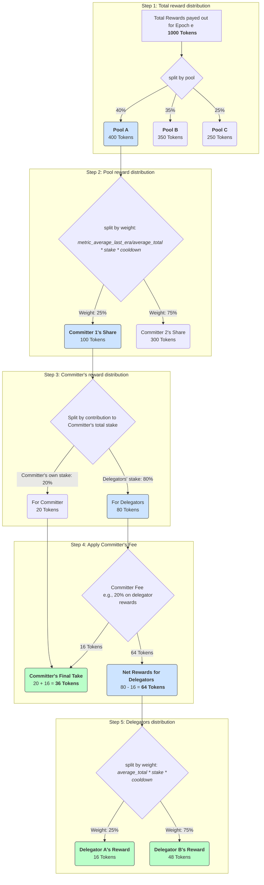

# Pool Distribution

```mermaid
graph TD
    subgraph "Step 1: Total reward distribution"
        A[Total Rewards payed out for Epoch e <br/> <b>1000 Tokens</b>] --> B{split by pool};
        B -- 40% --> C(<b>Pool A</b> <br/> 400 Tokens);
        B -- 35% --> D(<b>Pool B</b> <br/> 350 Tokens);
        B -- 25% --> E(<b>Pool C</b> <br/> 250 Tokens);
    end

    subgraph "Step 2: Pool reward distribution"
        C --> F{split by weight: <br/> <em>metric_average_last_era/average_total * stake * cooldown</em>};
        F -- Weight: 25% --> G(<b>Committer 1's Share</b> <br/> 100 Tokens);
        F -- Weight: 75% --> H(Committer 2's Share <br/> 300 Tokens);
    end

    subgraph "Step 3: Committer's reward distribution"
        G --> I{Split by contribution to Committer's total stake};
        I -- Committer's own stake: 20% --> J(For Committer <br/> 20 Tokens);
        I -- Delegators' stake: 80% --> K(For Delegators <br/> 80 Tokens);
    end

    subgraph "Step 4: Apply Committer's Fee"
        K --> L{Committer Fee <br/> e.g., 20% on delegator rewards};
        L -- 16 Tokens --> M(<b>Committer's Final Take</b> <br/> 20 + 16 = <b>36 Tokens</b>);
        L -- 64 Tokens --> N(<b>Net Rewards for Delegators</b> <br/> 80 - 16 = <b>64 Tokens</b>);
        J --> M;
    end
    
    subgraph "Step 5: Delegators distribution"
        N --> O{split by weight: <br/> <em>average_total * stake * cooldown</em>};
        O -- Weight: 25% --> P(<b>Delegator A's Reward</b> <br/> 16 Tokens);
        O -- Weight: 75% --> Q(<b>Delegator B's Reward</b> <br/> 48 Tokens);
    end

    style C fill:#cde4ff,stroke:#333
    style G fill:#cde4ff,stroke:#333
    style K fill:#cde4ff,stroke:#333
    style N fill:#cde4ff,stroke:#333

    style M fill:#baffc9,stroke:#333
    style P fill:#baffc9,stroke:#333
    style Q fill:#baffc9,stroke:#333
```